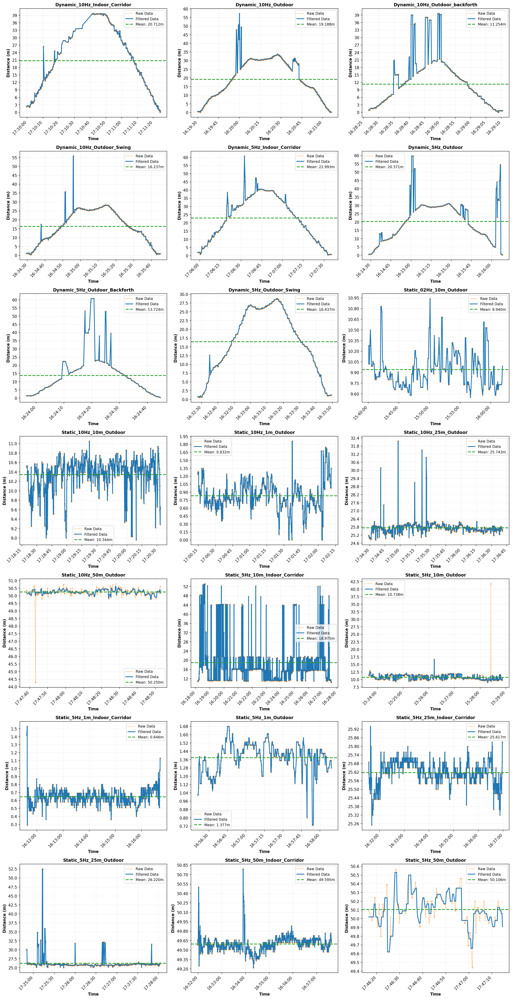

# Bluetooth 6.0 Channel Sounding Ranging Dataset (Pixel 10 Pro)

## 📖 Overview

This dataset accompanies our paper **"From Proximity to Precision: An Empirical Evaluation of Bluetooth Channel Sounding on Smartphones"** (submitted to *IPIN 2026*). It contains the complete set of ranging measurements collected with a commercial *smartphone (Google Pixel 10 Pro)* acting as the *Initiator* and a Nordic Semiconductor *nRF54L15* Development Kit acting as the *Reflector*, communicating via the Bluetooth 6.0 **Channel Sounding (CS)** protocol.

To the best of our knowledge, this is the **first publicly released CS ranging dataset captured on commercial off-the-shelf (COTS) smartphone hardware**, covering both static and dynamic scenarios in indoor and outdoor environments.

## 🛰️ Experimental Setup

| Component | Specification |
| :--- | :--- |
| Initiator | Google Pixel 10 Pro (Android 16, BT 6.0 HAL) |
| Reflector | Nordic Semiconductor nRF54L15 DK |
| Ground Truth | Qorvo DW3000 UWB modules (mechanically co-located with BT antennas) |
| Frequency Band | 2.4 GHz ISM, up to 72 channels |
| Update Rates | 0.2 Hz, 5 Hz, 10 Hz |
| Environments | Outdoor grassland (60 m × 30 m, LOS) / Indoor corridor (2.5 m wide, multipath-rich) |

## 📁 Repository Structure

```
dataset/
├── GT/                          # Ground-truth-aligned raw CS measurements
│   ├── Static_*.csv
│   ├── Dynamic_*.csv
│   └── vis.py                   # Visualization script
└── RangingFilter/               # Filtered CS outputs (post-processed)
    ├── Static_*.csv
    └── Dynamic_*.csv
```

- **`GT/`** — Raw CS distance samples paired with synchronized UWB ground-truth references, suitable for accuracy evaluation and algorithm training.
- **`RangingFilter/`** — Filtered ranging traces (smoothed/denoised CS output), useful as a baseline against which new filters can be compared.
- **`vis.py`** — Python script that reproduces the dataset overview figure shown below.

### File Naming Convention

Files follow the pattern:

```
<Mode>_<UpdateRate>_<Distance|Pattern>_<Environment>.csv
```

| Field | Possible Values |
| :--- | :--- |
| `Mode` | `Static`, `Dynamic` |
| `UpdateRate` | `02Hz` (0.2 Hz), `5Hz`, `10Hz` |
| `Distance` (static) | `1m`, `10m`, `25m`, `50m` |
| `Pattern` (dynamic) | *(none — linear walk)*, `Backforth`, `Swing` |
| `Environment` | `Outdoor`, `Indoor_Corridor` |

**Examples:**
- `Static_5Hz_10m_Outdoor.csv` — 10 m static measurement, 5 Hz update, outdoor LOS.
- `Dynamic_10Hz_Outdoor_Swing.csv` — Dynamic walk on a rectangular path with natural arm swing, 10 Hz, outdoor.
- `Dynamic_5Hz_Indoor_Corridor.csv` — Dynamic walk in indoor corridor at 5 Hz.

## 📊 Data Format

Each CSV file contains time-series ranging data with the following columns:

| Column | Description | Unit |
| :--- | :--- | :--- |
| `timestamp` | System timestamp of each CS measurement | HH:MM:SS.fff |
| `raw_distance` | Raw distance estimate from the Android CS HAL | m |
| `filtered_distance` | Smoothed/filtered distance (provided by the API/post-processing) | m |
| `gt_distance` *(GT/ only)* | UWB-based ground-truth distance | m |

> ⚠️ Some dynamic scenarios contain occasional `NaN` rows corresponding to dropped CS subevents or lost links (especially at 50 m where SNR approaches the Bluetooth connectivity threshold).

## 🧪 Scenario Matrix

### Static Scenarios

| Distance | Outdoor (5 Hz) | Outdoor (10 Hz) | Outdoor (0.2 Hz) | Indoor (5 Hz) |
| :--- | :---: | :---: | :---: | :---: |
| 1 m  | ✅ | ✅ | — | ✅ |
| 10 m | ✅ | ✅ | ✅ | ✅ |
| 25 m | ✅ | ✅ | — | ✅ |
| 50 m | ✅ | ✅ | — | ✅ |

### Dynamic Scenarios

| Pattern | Outdoor (5 Hz) | Outdoor (10 Hz) | Indoor (5 Hz) | Indoor (10 Hz) |
| :--- | :---: | :---: | :---: | :---: |
| Handheld linear walk        | ✅ | ✅ | ✅ | ✅ |
| Back & Forth (180° turn)    | ✅ | ✅ | — | — |
| Natural Arm Swing (rect.)   | ✅ | ✅ | — | — |

## 🖼️ Dataset Overview

The figure below provides a holistic visualization of all 21 ranging traces in the dataset (both raw and filtered), plotted against time. It can be regenerated using `GT/vis.py`.



## 📚 Citation

If you use this dataset, please cite our paper (to appear at **IPIN 2026**):

```bibtex
@inproceedings{xu2026ipin,
  title     = {From Proximity to Precision: An Empirical Evaluation of
               Bluetooth Channel Sounding on Smartphones},
  author    = {Ruijie Xu, Penghui Xu, Cheng Chang, Tung-Hao Hsu, and Li-Ta Hsu},
  booktitle = {Proc. International Conference on Indoor Positioning and
               Indoor Navigation (IPIN)},
  year      = {2026},
  note      = {To appear}
}
```

## 📜 License

This dataset is released under the **Creative Commons Attribution 4.0 International (CC BY 4.0)** license. You are free to share and adapt the material for any purpose, provided proper attribution is given.

## ✉️ Contact

For questions, bug reports, or collaboration inquiries, please contact ruijie.xu@connect.polyu.hk and pengh.xu@polyu.edu.hk.

